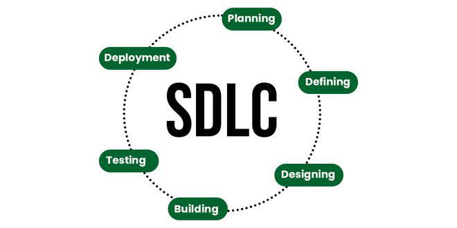

# Day 02 - Software Development Lifecycle (SDLC)

## Topics Covered

- What is Software Development Lifecycle (SDLC)?
- What phases do DevOps Engineers work on?
- Different frameworks:
  - Agile
  - Scrum

---

# What is Software Development Lifecycle (SDLC)?

Software Development Lifecycle (SDLC) is an industry-standard framework used to build high-quality software efficiently.

It mainly consists of six phases:

1. Planning
2. Defining
3. Designing
4. Building
5. Testing
6. Deployment

---

# What Phases Do DevOps Engineers Work On?

DevOps Engineers mainly work on automating and improving the following phases:

- Build
- Testing
- Deployment
- Monitoring
- Infrastructure Management

DevOps helps development and operations teams collaborate efficiently through automation and continuous delivery practices.

---

# Different Frameworks

## Agile

Agile is a software development methodology focused on:
- iterative development
- collaboration
- continuous feedback
- faster delivery

It helps teams adapt quickly to changing requirements.

---

## Scrum

Scrum is a framework under Agile that organizes work into short development cycles called sprints.

Key concepts in Scrum:
- Sprint Planning
- Daily Standups
- Sprint Review
- Retrospectives

---

# Key Takeaways

- SDLC provides a structured process for software development.
- DevOps Engineers automate build, test, and deployment processes.
- Agile and Scrum help teams deliver software faster and more efficiently.

---

# Resources

- DATE DevOps Playlist by Abhishekh Veermalla(free on youtube)
-[SDLC Explained] https://www.geeksforgeeks.org/software-engineering/software-development-life-cycle-sdlc/
-[Agile vs Scrum]https://www.geeksforgeeks.org/software-engineering/agile-vs-scrum-difference-between-agile-and-scrum-in-software-development/
---

# Conclusion

Today I learned the basics of SDLC, the role of DevOps Engineers in software delivery, and how Agile and Scrum frameworks improve development workflows.
