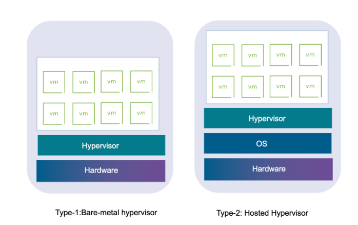

# Day 03 - Virtualization & Virtual Machines

## Topics Covered

- What is Virtualization?
- What is a Virtual Machine (VM)?
- Difference between Physical and Virtual Servers
- What is a Hypervisor?
- How to create a Virtual Machine

---

# Concepts

## What is Virtualization?

Virtualization is the process of creating virtual versions of physical resources such as servers, storage, operating systems, or networks.

It allows multiple virtual machines to run on a single physical machine using shared hardware resources.

Benefits of virtualization:
- Better resource utilization
- Reduced hardware cost
- Isolation between environments
- Easier scalability and management

---

## What is a Virtual Machine (VM)?

A Virtual Machine (VM) is a software-based computer that runs its own operating system and applications just like a physical computer.

Each VM has:
- CPU
- Memory
- Storage
- Network interfaces

Virtual machines run on top of a hypervisor.

---

## Difference Between Physical and Virtual Servers

| Physical Server | Virtual Server |
|----------------|----------------|
| Runs directly on hardware | Runs on top of a hypervisor |
| Dedicated resources | Shared resources |
| Higher hardware cost | More cost-efficient |
| Harder to scale | Easier to scale |
| Limited flexibility | Flexible and portable |

---

## What is a Hypervisor? 

A Hypervisor is software that creates and manages virtual machines.

It allows multiple operating systems to share the same physical hardware.

### Types of Hypervisors

1. Type 1 (Bare Metal)
   - Runs directly on hardware
   - Better performance
   - Example: VMware ESXi

2. Type 2 (Hosted)
   - Runs on top of an operating system
   - Easier for beginners
   - Example: VirtualBox, VMware Workstation

---

## Creating a Virtual Machine

Basic steps to create a VM:

1. Install virtualization software
2. Download an operating system ISO
3. Allocate CPU, RAM, and storage
4. Create the VM
5. Install the operating system

---

# Key Takeaways

- Virtualization allows efficient hardware utilization.
- Virtual Machines act like independent computers.
- Hypervisors manage virtual machines.
- Virtual servers are more flexible and scalable than physical servers.

---
# Resources

[Virtualization] https://www.ibm.com/think/topics/virtualization

[Hypervisor] https://www.vmware.com/topics/hypervisor

---

# Conclusion

Today I learned the fundamentals of virtualization, virtual machines, hypervisors, and how virtual environments improve scalability and resource utilization in modern infrastructure.
